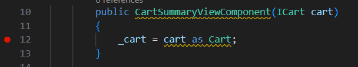
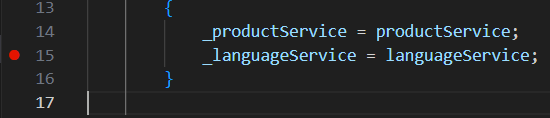
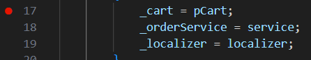
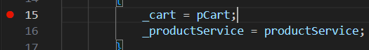
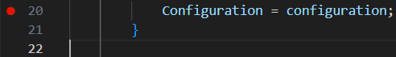
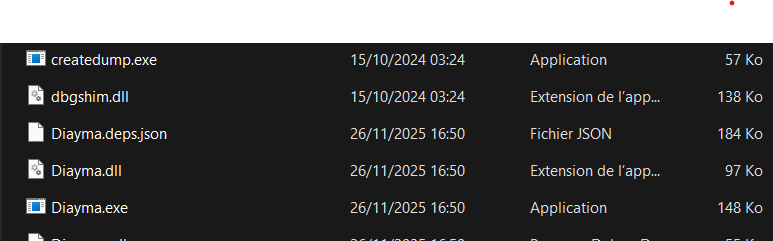

# Travaux Dirigés .NET - ESP UCAD

**Année Universitaire :** 2025/2026

**Professur :** Dr El Hadji Ousmane DIALLO

**Etudiant :** Papa Amadou Mandiaye NDIAYE - Master 2 Génie logiciel et Systèmes d'Information

**Objectif :** Familiarisation avec l'EDI, Git et GitHub, et exploration d'une application .NET.

---

## 1. Recupération du Code 
*wget https://github.com/devehod/BoutiqueDiayma2025.git*

---

## 2. Quels sont les projets de la solution ?

La solution contient 1 projet : **P2FixAnAppDotNetCode\Diayma.csproj**

---

## 3. Quelle est la version SDK .NET utilisée par ces projets ?

La version SDK .NET utilisée est la version : **netcoreapp2.0**

---

## 4. Installation du SDK

*dotnet --list-sdks*  

*Mon Résultat :*

***10.0.100 [C:\Program Files\dotnet\sdk]***

---

## 5. Création du Dépôt GitHub

*git remote remove origin*

*git remote add origin https://github.com/AmadouNDIAYE-221/TD-C-et-Technologies-.NET-Visual-Studio-D-bogage-v2.git*

*git branch -M main*

*git add .*

*git commit -m "Premier commit !"*

*git push -u origin main*

---

## 6. Explorez l’application. Signalez 2 bugs trouvés ?

*Après l'exécution de l'application DIAYMA, nous avons constaté deux bugs fonctionnels :*

*-Impossible de **terminer la commande** : le message "The Lines field is required" apparaît et bloque l’action.*

*-Impossible de **changer la langue de l’application** : l’option pour passer en "espagnol" ne fonctionne pas.*

---

## 7. Placement des Breakpoints

Plaçons les points d'arrêts au nuiveau des différents classes concernées :
  
   ### a) CartSummaryViewComponent ligne 12 
   

   ### b) ProductController ligne 15
   

   ### c) OrderController ligne 17 
   

   ### d) CartController ligne 15 
   
   
   ### e) Startup ligne 20 
   

---

## 8. Namespaces, classes et méthodes visités avant l’affichage des produits

En lançant le débogage avec F5, j’ai suivi l’exécution de l’application à l’aide des touches F10 (*Pas à pas principal*) et F11 (*Pas à pas détaillé*).

Les points d’arrêt placés dans les fichiers indiqués ont permis d’identifier le pipeline réel d’exécution avant l’affichage des produits sur la page d’accueil.

*Voici l’ordre exact observé :*

### 8.1 Starup.cs

**Namespace** : *BoutiqueDiayma2025*

**Classe :** *Startup*

**Méthodes visitées :**

    -ConfigureServices()

    -Configure()

Ces méthodes préparent le pipeline HTTP, les services, le routage et la configuration globale de l’application.

### 8.2 ProductController.cs

**Namespace :** *BoutiqueDiayma2025.Controllers*

**Classe :** *ProductController*

**Méthode visitée :** *Index()*

*C’est la méthode responsable de récupérer la liste des produits et de l’envoyer à la vue d’accueil*

### 8.3 CartSummaryViewComponent.cs

**Namespace :** *BoutiqueDiayma2025.Components*

**Classe :** *CartSummaryViewComponent*

**Méthode visitée :** *InvokeAsync()*

*Ce composant est exécuté automatiquement par la vue d’accueil pour afficher un résumé du panier de l’utilisateur.*

### 8.4 LanguageSelectorViewComponent.cs

**Namespace :** *BoutiqueDiayma2025.Components*

**Classe :** *LanguageSelectorViewComponent*

**Méthode visitée :** *InvokeAsync()*

*Ce composant détermine la langue d’affichage de l’interface avant que la vue finale soit rendue.*

Après le LanguageSelectorViewComponent, l’exécution entre dans du code interne du framework ASP.NET Core.
Ce code appartient aux bibliothèques Microsoft, pas à notre projet, donc les breakpoints ne se déclenchent plus et l’exécution n’affiche plus nos fichiers.

Cela signifie que :

Nous avons terminé le parcours du pipeline du projet avant l’affichage des produits.

---

## 9. Déploiment de la solution sous forme d’exécutable Windows. 
Dans Visual Studio 2026, pour déployer le projet et avoir l'exécutable. On clique sur ***Générer*** puis sur ***Publier Diayma*** sans oublier de définir l'emplacement et l'architecture du système cible *"**Winx64**"*

---

## 10. Lien Drive à l'exécutable

Lien Drive : https://drive.google.com/drive/folders/1tfZ9CzwOT9Cf6G2Ih229qtWsShqVd8u2

L'exécutable "***Diayma.exe***" se trouve au niveau du répertoire Diayma du  Drive (Consulter le lien)

---

## 11. Optionnel 

### a. Ajout du language wolof à l'interface 
Pour l'ajout de la langue wolof  : 

-on ajoute un fichier ***Completed.wo.resx*** et ***index.wo.resx*** au niveau du répertoire Ressources/Views/Order avec du contenu en wolof contenant les termes appropriés, inspirer et traduites des fichiers ***Completed.fr.resx*** et ***index.fr.resx***.

-Ensuite on modifier le fichier ***Default.cshtml*** situé dans Views/Shared/Components/LanguageSelector pour l'ajout de l'option *"wolof"* en ajoutant dans la section correspondante :

  `<option value="Wolof">@Localizer["LanguageWolof"]</option>  <!--Pour le langage Wolof -->`
 
-Dans ***Models/Sevices/LanguageService.cs*** on ajoute la case wolof :

    case "Wolof":      //Pour le wolof à l'instar de Français et autres 
    culture = "wo";
    break;

-Dans ***Startup.cs***

 on ajoute :

    new CultureInfo("wo")  // Pour la langue Wolof

-Enfin, toujours dans **P2FixAnAppDoNetCode/Ressources/Views** on fait de même pour ***Cart*** et ***Product*** comme fait précédemment avec ***Order***.  
Pour que la langue wolof puisse couvrir l'intégralité de l'application.

### b. Procéder la trois commits
Plusieurs commits ont été effectués allant de l'initialisation à la soumission final du projet.  
Ces principaux commits sont :

    git commit -m "Premier commit"*
    git commit -m "Mise à jour du projet : modifications des vues et du code"
    git commit -m "Mise à jour du projet : modifications du fichier README"
    git commit -m "Mise à jour du projet : modifications final"
    Etc ...

### c. Lien Github

Lien : https://github.com/AmadouNDIAYE-221/TD-C-et-Technologies-.NET-Visual-Studio-D-bogage-v2.git
