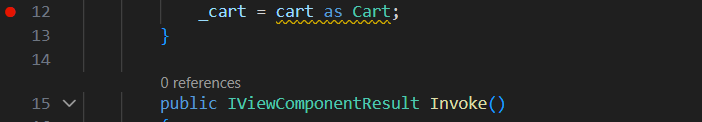

# Travaux Dirigés .NET - ESP UCAD

**Année Universitaire :** 2025/2026

**Objectif :** Familiarisation avec l'EDI, Git et GitHub, et exploration d'une application .NET.

---

## 2. Quels sont les projets de la solution ?

*La solution contient 1 projet : **P2FixAnAppDotNetCode\Diayma.csproj***

---

## 3. Quelle est la version SDK .NET utilisée par ces projets ?

*La version SDK .NET utilisée est la version : **netcoreapp2.0***

---

## 4. Installation du SDK

*dotnet --list-sdks*  

*Mon Résultat :*

**10.0.100 [C:\Program Files\dotnet\sdk]**

---

## 5. Création du Dépôt GitHub

*git remote remove origin*

*git remote add origin https://github.com/AmadouNDIAYE-221/TD-C-et-Technologies-.NET-Visual-Studio-D-bogage-v2.git*

*git branch -M main*

*git add .*

*git commit -m "Premier commit !"*

*git push -u origin main*

---

## 6. Explorez l’application. Signalez 2 bugs trouvés ?

*Après l'exécution de l'application DIAYMA, nous avons constaté deux bugs fonctionnels :*

*-Impossible de **terminer la commande** : le message "The Lines field is required" apparaît et bloque l’action.*

*-Impossible de **changer la langue de l’application** : l’option pour passer en "espagnol" ne fonctionne pas.*

---

## 7. Placement des Breakpoints

*test image*
*Fournissez ici le lien Google Drive, OneDrive, etc. vers l'exécutable Windows de votre solution, comme demandé dans la tâche 7.*

## 5. Namespaces, classes et méthodes visités avant l’affichage des produits

*En lançant le débogage avec F5, j’ai suivi l’exécution de l’application à l’aide des touches F10 (Step Over) et F11 (Step Into).*

*Les points d’arrêt placés dans les fichiers indiqués ont permis d’identifier le pipeline réel d’exécution avant l’affichage des produits sur la page d’accueil.*

*Voici l’ordre exact observé :*

